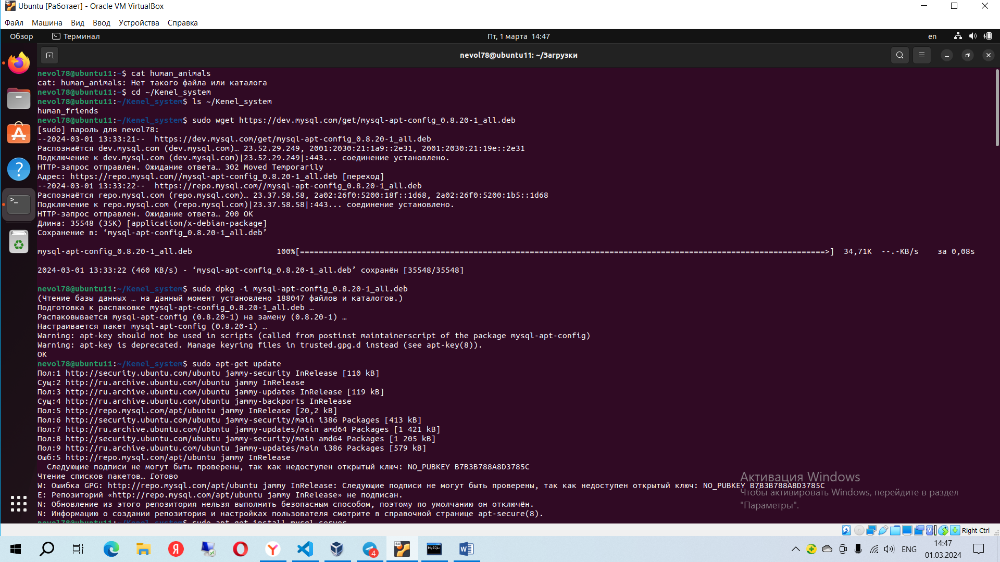
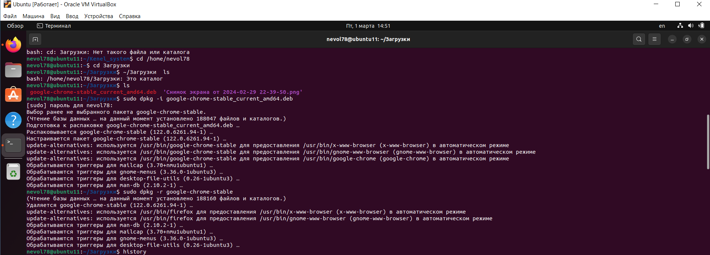
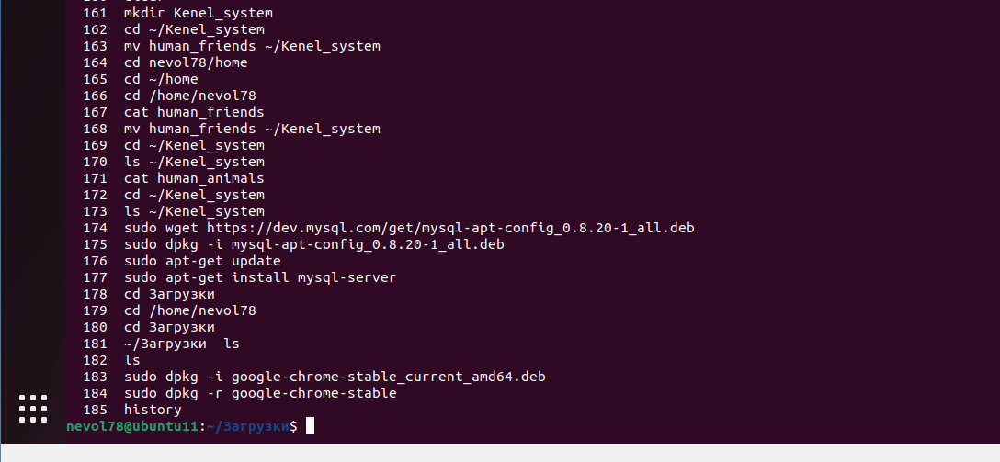
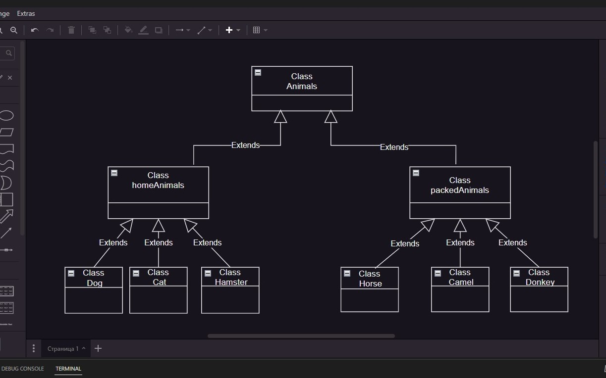

## Информация о проекте
Необходимо организовать систему учета для питомника, в котором живут
домашние и вьючные животные.

## Задание
1. Используя команду cat в терминале операционной системы Linux, создать
два файла Домашние животные (заполнив файл собаками, кошками,
хомяками) и Вьючные животными заполнив файл Лошадьми, верблюдами и
ослы), а затем объединить их. Просмотреть содержимое созданного файла.
Переименовать файл, дав ему новое имя (Друзья человека).


2. Создать директорию, переместить файл туда.


3. Подключить дополнительный репозиторий MySQL. Установить любой пакет
из этого репозитория.




4. Установить и удалить deb-пакет с помощью dpkg.



5. Выложить историю команд в терминале ubuntu




6. Нарисовать диаграмму, в которой есть класс родительский класс, домашние животные и вьючные животные, в составы которых в случае домашних животных войдут классы: собаки, кошки, хомяки, а в класс вьючные животные войдут: Лошади, верблюды и ослы.



7. В подключенном MySQL репозитории создать базу данных “Друзья
человека”
```sql
CREATE DATABASE Human_friends;
```

8. Создать таблицы с иерархией из диаграммы в БД
```sql
use human_friends;

CREATE TABLE animal_classes
(
	Id INT AUTO_INCREMENT PRIMARY KEY, 
	Class_name VARCHAR(20)
);

INSERT INTO animal_classes (Class_name)
VALUES ('вьючные'),
('домашние');  


CREATE TABLE packed_animals
(
	  Id INT AUTO_INCREMENT PRIMARY KEY,
    Name VARCHAR (20),
    Class_id INT,
    FOREIGN KEY (Class_id) REFERENCES animal_classes (Id) ON DELETE CASCADE ON UPDATE CASCADE
);

INSERT INTO packed_animals (Name, Class_id)
VALUES ('Лошади', 1),
('Ослы', 1),  
('Верблюды', 1); 
    
CREATE TABLE home_animals
(
	  Id INT AUTO_INCREMENT PRIMARY KEY,
    Name VARCHAR (20),
    Class_id INT,
    FOREIGN KEY (Class_id) REFERENCES animal_classes (Id) ON DELETE CASCADE ON UPDATE CASCADE
);

INSERT INTO home_animals (Name, Class_id)
VALUES ('Кошки', 2),
('Собаки', 2),  
('Хомяки', 2); 
```
9. Заполнить низкоуровневые таблицы именами(животных), командами
которые они выполняют и датами рождения
```sql
CREATE TABLE cats 
(       
    Id INT AUTO_INCREMENT PRIMARY KEY, 
    Nickname VARCHAR(20), 
    Birthday DATE,
    Commands VARCHAR(50),
    Name_id int,
    Foreign KEY (Name_id) REFERENCES home_animals (Id) ON DELETE CASCADE ON UPDATE CASCADE
);

INSERT INTO cats (Nickname, Birthday, Commands, Name_id)
VALUES ('Маруся', '2018-12-08', 'принеси', 1),
('Тимка', '2014-09-01', "нельзя", 1),  
('Дениска', '2020-03-10', "кис-кис", 1);

CREATE TABLE dogs 
(       
    Id INT AUTO_INCREMENT PRIMARY KEY, 
    Nickname VARCHAR(20), 
    Birthday DATE,
    Commands VARCHAR(50),
    Name_id int,
    Foreign KEY (Name_id) REFERENCES home_animals (Id) ON DELETE CASCADE ON UPDATE CASCADE
);

INSERT INTO dogs (Nickname, Birthday, Commands, Name_id)
VALUES ('Пират', '2018-03-11', 'лежать, лапу, голос', 2),
('Шарик', '2022-01-12', "сидеть, лежать, лапу", 2),   
('Дик', '2019-04-16', "сидеть, лежать, ко мне", 2);

CREATE TABLE hamsters 
(       
    Id INT AUTO_INCREMENT PRIMARY KEY, 
    Nickname VARCHAR(20), 
    Birthday DATE,
    Commands VARCHAR(50),
    Name_id int,
    Foreign KEY (Name_id) REFERENCES home_animals (Id) ON DELETE CASCADE ON UPDATE CASCADE
);

INSERT INTO hamsters (Nickname, Birthday, Commands, Name_id)
VALUES ('Хома', '2021-07-12', NULL, 3),
('Пуся', '2023-09-04', "в клетку", 3),   
('Малыш', '2024-01-10', NULL, 3);

CREATE TABLE horses 
(       
    Id INT AUTO_INCREMENT PRIMARY KEY, 
    Nickname VARCHAR(20), 
    Birthday DATE,
    Commands VARCHAR(50),
    Name_id int,
    Foreign KEY (Name_id) REFERENCES packed_animals (Id) ON DELETE CASCADE ON UPDATE CASCADE
);

INSERT INTO horses (Nickname, Birthday, Commands, Name_id)
VALUES ('Сивко', '2019-01-10', 'но, тпру', 1),
('Савраска', '2018-05-01', "но, стой", 1),  
('Ветер', '2021-10-03', "но, стой, вперед", 1);

CREATE TABLE donkeys 
(       
    Id INT AUTO_INCREMENT PRIMARY KEY, 
    Nickname VARCHAR(20), 
    Birthday DATE,
    Commands VARCHAR(50),
    Name_id int,
    Foreign KEY (Name_id) REFERENCES packed_animals (Id) ON DELETE CASCADE ON UPDATE CASCADE
);

INSERT INTO donkeys (Nickname, Birthday, Commands, Name_id)
VALUES ('Иа', '2021-06-14', NULL, 2),
('Гелла', '2023-02-01', "стой", 2),   
('Мерфи', '2022-11-10', NULL, 2);

CREATE TABLE camels 
(       
    Id INT AUTO_INCREMENT PRIMARY KEY, 
    Nickname VARCHAR(20), 
    Birthday DATE,
    Commands VARCHAR(50),
    Name_id int,
    Foreign KEY (Name_id) REFERENCES packed_animals (Id) ON DELETE CASCADE ON UPDATE CASCADE
);

INSERT INTO camels (Nickname, Birthday, Commands, Name_id)
VALUES ('Вася', '2020-10-10', 'гит, каш', 3),
('Твист', '2021-03-24', "каш, стой", 3),   
('Ланцелот', '2023-01-12', "гит, каш, стой", 3);
```

10. Удалив из таблицы верблюдов, т.к. верблюдов решили перевезти в другой
питомник на зимовку. Объединить таблицы лошади, и ослы в одну таблицу.
```sql
DELETE FROM camels where id > 0;

CREATE TABLE packed_animals_new (id INT NOT NULL AUTO_INCREMENT PRIMARY KEY)
SELECT  Nickname, 
        Commands, 
        Birthday
FROM horses UNION 
SELECT  Nickname, 
        Commands, 
        Birthday
FROM donkeys;
```

11. Создать новую таблицу “молодые животные” в которую попадут все
животные старше 1 года, но младше 3 лет и в отдельном столбце с точностью
до месяца подсчитать возраст животных в новой таблице
```sql
CREATE TEMPORARY TABLE animals AS 
SELECT *, 'Лошади' as type FROM horses
UNION SELECT *, 'Ослы' AS type FROM donkeys
UNION SELECT *, 'Собаки' AS type FROM dogs
UNION SELECT *, 'Кошки' AS type FROM cats
UNION SELECT *, 'Хомяки' AS type FROM hamsters;

CREATE TABLE young_animals AS
SELECT Nickname, Birthday, Commands, type, TIMESTAMPDIFF(MONTH, Birthday, CURDATE()) AS Age_in_month
FROM animals WHERE Birthday BETWEEN ADDDATE(curdate(), INTERVAL -3 YEAR) AND ADDDATE(CURDATE(), INTERVAL -1 YEAR);
 
SELECT * FROM young_animals;
```
12. Объединить все таблицы в одну, при этом сохраняя поля, указывающие на
прошлую принадлежность к старым таблицам.
```sql
CREATE TABLE human_friends_new (id INT NOT NULL AUTO_INCREMENT PRIMARY KEY)
SELECT horse.Nickname, horse.Birthday, horse.Commands, packed.Name, young.Age_in_month 
FROM horses horse
LEFT JOIN young_animals young ON young.Nickname = horse.Nickname
LEFT JOIN packed_animals packed ON packed.Id = horse.Name_id
UNION 
SELECT donkey.Nickname, donkey.Birthday, donkey.Commands, packed.Name, young.Age_in_month 
FROM donkeys donkey 
LEFT JOIN young_animals young ON young.Nickname = donkey.Nickname
LEFT JOIN packed_animals packed ON packed.Id = donkey.Name_id
UNION
SELECT cat.Nickname, cat.Birthday, cat.Commands, home.Name, young.Age_in_month 
FROM cats cat
LEFT JOIN young_animals young ON young.Nickname = cat.Nickname
LEFT JOIN home_animals home ON home.Id = cat.Name_id
UNION
SELECT dog.Nickname, dog.Birthday, dog.Commands, home.Name, young.Age_in_month 
FROM dogs dog
LEFT JOIN young_animals young ON young.Nickname = dog.Nickname
LEFT JOIN home_animals home ON home.Id = dog.Name_id
UNION
SELECT hamster.Nickname, hamster.Birthday, hamster.Commands, home.Name, young.Age_in_month 
FROM hamsters hamster
LEFT JOIN young_animals young ON young.Nickname = hamster.Nickname
LEFT JOIN home_animals home ON home.Id = hamster.Name_id;
```

13. Создать класс с Инкапсуляцией методов и наследованием по диаграмме.
14. Написать программу, имитирующую работу реестра домашних животных.
В программе должен быть реализован следующий функционал:    
	14.1 Завести новое животное    
	14.2 определять животное в правильный класс    
	14.3 увидеть список команд, которое выполняет животное    
	14.4 обучить животное новым командам    
	14.5 Реализовать навигацию по меню    
15. Создайте класс Счетчик, у которого есть метод add(), увеличивающий̆ значение внутренней̆ int переменной̆ на 1 при нажатии “Завести новое животное” Сделайте так, чтобы с объектом такого типа можно было работать в блоке try-with-resources. Нужно бросить исключение, если работа с объектом типа счетчик была не в ресурсном try и/или ресурс остался открыт. Значение считать в ресурсе try, если при заведении животного заполнены все поля.
